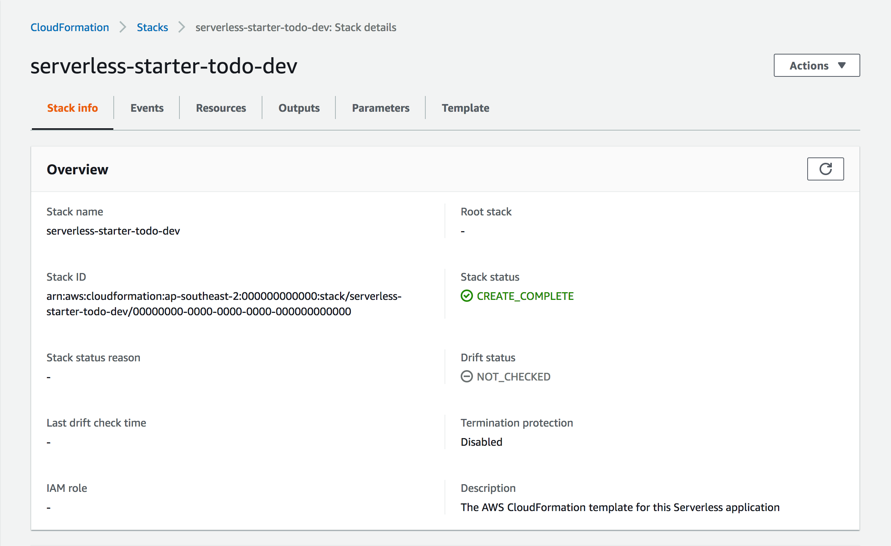
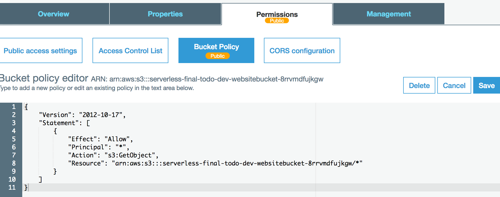
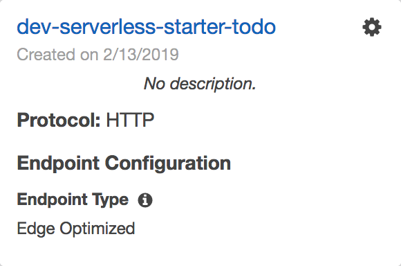
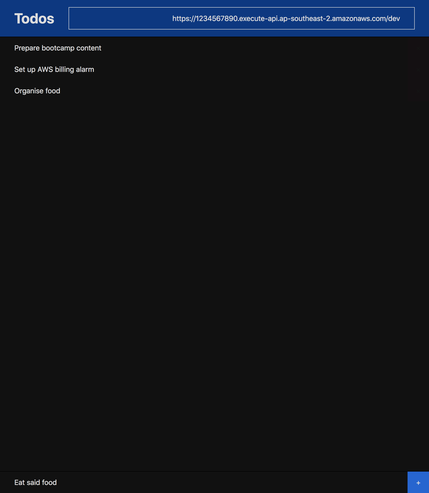

# Serverless Starter TODO

Starter template for a todo app.

```plaintext
S3 -- API Gateway -- Lambda -- DynamoDB
```

> **Disclaimer:** for ease of use, the API will have CORS fully enabled, reveals
> server error details to the client, and has no authentication. You shouldn't
> have such a configuration on an actual production system.

## Prerequisites

1. [AWS CLI](https://aws.amazon.com/cli/)

1. AWS credentials on your computer:

   ```shell
   aws configure
   ```

1. [Node.js + npm](https://nodejs.org/)

1. Serverless Framework:

   ```shell
   npm install -g serverless
   ```

## 1. Start with template

Copy starter files from our template:

```shell
serverless create --template-url https://github.com/DevOps-Girls/DevOps-Girls-Bootcamp-4/tree/master/serverless-starter-todo

# Serverless: Generating boilerplate...
# Serverless: Downloading and installing "serverless-starter-todo"...
# Serverless: Successfully installed "serverless-starter-todo"

cd serverless-starter-todo
```

Open the _serverless.yml_ file, which describes a serverless application.

---

It begins by listing out some basic details:

```yaml
service: serverless-starter-todo

provider:
  name: aws
  region: ${opt:region, 'ap-southeast-2'}
  runtime: nodejs8.10
  stackName: serverless-starter-todo-dev
  stage: ${opt:stage, 'dev'}
  iamRoleStatements:
    # Replace these square brackets with IAM permissions.
    []
```

- We'll be running on AWS
- We're using the Node.js JavaScript runtime for our API
- We'll default the application to run in Sydney (**ap-southeast-2**)
- We'll default the application stage to pre-production (**dev**)

---

It also includes a CloudFormation resources section at the end, which is AWS's
way of managing infrastructure as code. We can describe a DynamoDB table, S3
bucket, and much more here, and they will be automatically created/updated
whenever we run `serverless deploy`.

```yaml
resources:
  Resources:
    # Replace these curly brackets with CloudFormation resources.
    {}

  Outputs:
    # Replace these curly brackets with CloudFormation outputs.
    {}
```

## 2. Create S3 bucket

```plaintext
S3 -- API Gateway -- Lambda -- DynamoDB
^^
```

---

Have a quick look at the CloudFormation documentation for S3 buckets:

<https://docs.aws.amazon.com/AWSCloudFormation/latest/UserGuide/aws-properties-s3-bucket.html>

---

Describe the bucket under the **resources** section:

```yaml
resources:
  Resources:
    WebsiteBucket:
      Type: AWS::S3::Bucket
      Properties:
        # add properties here

  Outputs:
    WebsiteBucketName:
      Value:
        Ref: WebsiteBucket
```

Properties that we want to add:

- **WebsiteConfiguration**: we want to configure the bucket for website hosting,
  and set the home page to _index.html_

---

Add a bucket policy below it:

```yaml
resources:
  Resources:
    WebsiteBucket:
      # same as above
      ...
    WebsiteBucketPolicy:
      Type: AWS::S3::BucketPolicy
      Properties:
        PolicyDocument:
          Version: '2012-10-17'
          Statement:
            - Action: s3:GetObject
              Effect: Allow
              Principal: '*'
              Resource:
                Fn::Join:
                  - ''
                  - - 'arn:aws:s3:::'
                    - Ref: WebsiteBucket
                    - /*
        Bucket:
          Ref: WebsiteBucket
```

This allows anyone to read the files in the bucket, which is what we want,
as the website should be accessible from any device or browser.

---

Let's run a `serverless deploy` to create our S3 bucket:

```shell
serverless deploy --verbose

# Service Information
# service: serverless-starter-todo
# stage: dev
# region: ap-southeast-2
# stack: serverless-starter-todo-dev
# api keys:
#   None
```

---

Verify your changes in the AWS web interface:

- <https://console.aws.amazon.com/cloudformation/home>
- <https://console.aws.amazon.com/s3/home>

What do you see?

<details><summary>Show</summary><p>

You should see a new CloudFormation stack:



And that stack creation should have included an S3 bucket with a public bucket
policy:



</p></details>

## 3. Upload static website

```plaintext
S3 -- API Gateway -- Lambda -- DynamoDB
^^
```

---

Review the output of `serverless deploy`:

```shell
# Stack Outputs
# WebsiteBucketName: serverless-starter-todo-dev-XXXXXX
```

You'll find the name of your S3 bucket.

---

Upload the HTML, CSS and JS files in the `websites` folder to S3 (use your real
bucket name):

```shell
aws s3 sync website/ s3://serverless-starter-todo-dev-XXXXXX
```

---

Try visiting your website (use your real bucket name as the subdomain):

```plaintext
http://serverless-starter-todo-dev-XXXXXX.s3-website-ap-southeast-2.amazonaws.com/
```

What do you see?

<details><summary>Show</summary><p>

You should be able to see the basic layout of the todo app.

However, the todo list would be empty, and you wouldn't be able to add any new
todos. This is because we haven't set up a backend that the website can read
todos from and write todos to.

</p></details>

## 4. Create API

```plaintext
S3 -- API Gateway -- Lambda -- DynamoDB
      ^^^^^^^^^^^^^^^^^^^^^
```

To create a serverless API with API Gateway and Lambda, we need to add two new
sections to our `serverless.yml`:

- **package**
- **functions**

---

What do you think this section does?

```yaml
package:
  include:
    - index.js
```

<details><summary>Show</summary><p>

The **package** section describes the code files on your computer that form the
API. This includes logic to write todos to and read todos from a database.

The files included in the package are uploaded to an S3 bucket, so that Lambda
can access the files and run your API.

</p></details>

---

How about this section?

```yaml
functions:
  TodoApi:
    name: serverless-starter-todo-api-dev
    handler: index.handler
    events:
      - http:
          cors: true
          method: any
          path: /{proxy+}
```

<details><summary>Show</summary><p>

The **functions** section describes a Lambda function that can respond to HTTP
requests.

**index.handler** tells a (JavaScript) Lambda function to open a _index.js_ file
and call the **handler** function when a HTTP request is received.

We have configured API Gateway to allow **any** method, and any path with the
**{proxy+}** path variable. This is [Lambda proxy integration].

In short, it means that all types of requests are sent to our Lambda function,
and our code is responsible for checking the request method and path, and
figuring out what to do.

[lambda proxy integration]: https://docs.aws.amazon.com/apigateway/latest/developerguide/api-gateway-set-up-simple-proxy.html#lambda-proxy-integration-with-proxy-resource

</p></details>

---

Run the `serverless deploy` command:

```shell
serverless deploy --verbose

# Service Information
# service: serverless-starter-todo
# stage: dev
# region: ap-southeast-2
# stack: serverless-starter-todo-dev
# api keys:
#   None
# endpoints:
#   ANY - https://1234567890.execute-api.ap-southeast-2.amazonaws.com/dev/{proxy+}
# functions:
#   TodoApi: serverless-starter-todo-dev-TodoApi
#
# Stack Outputs
# TodoApiLambdaFunctionQualifiedArn: arn:aws:lambda:ap-southeast-2:123456789012:function:serverless-starter-todo-api-dev:1
# ServiceEndpoint: https://1234567890.execute-api.ap-southeast-2.amazonaws.com/dev
# ServerlessDeploymentBucketName: serverless-starter-todo-serverlessdeploymentbuck-abcdefghijkl
```

---

Review your changes in the AWS web interface.

- <https://console.aws.amazon.com/apigateway/home>
- <https://console.aws.amazon.com/lambda/home>

What do you see?

<details><summary>Show</summary><p>

You should see that a new API Gateway has been created:



And a Lambda function has been created and automatically hooked up to that API
Gateway:


</p></details>

---

Try out your new API (use your real endpoint, and add `/todos` on the end):

```plaintext
https://xxxxxxxxxx.execute-api.ap-southeast-2.amazonaws.com/dev/todos
```

What do you see?

<details><summary>Show</summary><p>
You should see something like this:

```json
{
  "error": "Error: I don't have a TABLE_NAME environment variable, so I don't know where to read and write your todos.",
  "message": "error handling request"
}
```

The issue with our Lambda function is that it's missing the name of the
database table to store our todos in. That's because we haven't created the
database table yet!

We can also look at the logs to see what happened:

<https://ap-southeast-2.console.aws.amazon.com/cloudwatch/home?region=ap-southeast-2#logEventViewer:group=/aws/lambda/serverless-starter-todo-api-dev>

</p></details>

## 5. Create database table

```plaintext
S3 -- API Gateway -- Lambda -- DynamoDB
                               ^^^^^^^^
```

We now have an API that we can call from our website to read and write todos.
The API needs to store the todos somewhere, so that they aren't lost once you
close your browser tab, and so you can access them across your laptop, phone,
etc.

---

Have a quick look at the CloudFormation documentation for DynamoDB tables:

<https://docs.aws.amazon.com/AWSCloudFormation/latest/UserGuide/aws-resource-dynamodb-table.html>

---

Add a database table to the **resources** section:

```yaml
resources:
  Resources:
    DatabaseTable:
      Type: AWS::DynamoDB::Table
      Properties:
        # more stuff here
```

Properties that we want to add:

- **AttributeDefinitions**, **KeySchema**: we want to create an **id** primary
  key in our table
- **BillingMode**: set this to **PAY_PER_REQUEST** to avoid paying ongoing costs
  while the database is not doing anything

---

Run `serverless deploy` to create your database table:

```shell
serverless deploy --verbose
```

---

Review your changes in the AWS web interface:

<https://console.aws.amazon.com/dynamodb/home>

What do you see?

<details><summary>Show</summary><p>
You should see a new database table:


</p></details>

## 6. Wire up the backend

```plaintext
S3 -- API Gateway -- Lambda -- DynamoDB
                            ^^
```

---

Add permissions for your Lambda function to communicate with your new table:

```yaml
provider:
  ...
  iamRoleStatements:
    - Effect: Allow
      Action:
        - dynamodb:DeleteItem
        - dynamodb:PutItem
        - dynamodb:Scan
      Resource:
        Fn::Join:
          - ''
          - - 'arn:aws:dynamodb:'
            - Ref: AWS::Region
            - ':'
            - Ref: AWS::AccountId
            - :table/
            - Ref: DatabaseTable
```

---

Add the table's name as an environment variable, so your Lambda function knows
where to store the todos:

```yaml
functions:
  TodoApi:
    ...
    environment:
      TABLE_NAME:
        Ref: DatabaseTable
```

---

Run `serverless deploy` to create the links between your Lambda function and
DynamoDB table:

```shell
serverless deploy --verbose
```

---

Try out your new API (use your real endpoint, and add `/todos` on the end):

```plaintext
https://xxxxxxxxxx.execute-api.ap-southeast-2.amazonaws.com/dev/todos
```

What do you see?

<details><summary>Show</summary><p>

You should see something like this:

```json
[]
```

</p></details>

## 7. Wire up the frontend

```plaintext
S3 -- API Gateway -- Lambda -- DynamoDB
   ^^
```

---

Paste your API URL into the top right input field (without `/todos` on the end):


---

Try to add, edit, and delete some todos!



## What's next

Some ideas:

- Authentication and authorisation
- HTTPS and a nice domain name
- Completing todos, changing their order, etc.
